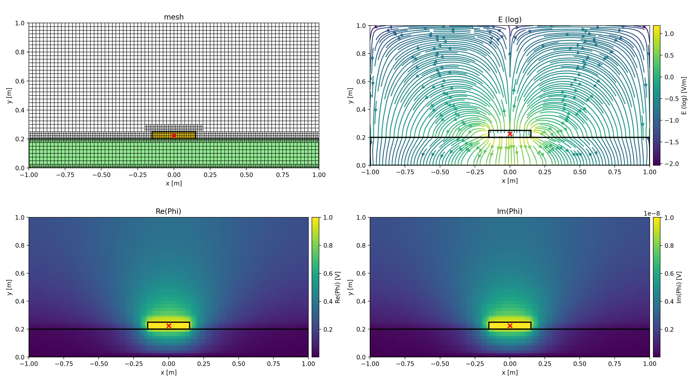

# A Quasi-Electrostatic Finite Volume Method using Quadtrees

This is a 2D finite volume method that solves the poisson equation for the quasi electrostatic potential in the frequency domain. It can compute multi port impedances by placing lumped current ports in the simulation domain. The common types of boundary conditions are supported such as Dirichlet, Neumann and periodic boundary conditions.

The package also implements a novel cell interface modeling technique based on lumped elements. This is used to model doublelayer capacitances for example at electrode-liquid interfaces. A paper about this has been submitted to Helyon (cell press). Simulations and geometries from the paper are available in the `example` directory.


## Reference

This is the repository for the paper **A finite volume method with interface capacitance insertion on quad-tree meshes for impedance analysis in microfluidic devices** ([DOI](https://doi.org/10.1016/j.heliyon.2025.e43066)).


## Getting started

We need to import `numpy` and `matplotlib` only for the definition of the structures and for plotting the results


```python
import numpy as np

#imports for plotting
from matplotlib import pyplot as plt
from matplotlib.collections import PatchCollection
from matplotlib.patches import Rectangle

%matplotlib notebook
```

From the `qesfvm` package we need to import the `Simulation` class that handles the meshing, construction of the system matrix and solution as well as the incorporation of boundary conditions, materials and ports. 
The `Material` and `Port` classes are instanced to build the problem geometry and assign the material parameters as well as define the lumped ports.


```python
#qesfvm imports
from qesfvm.simulation import Simulation
from qesfvm.materials import Material
from qesfvm.ports import Port
from qesfvm.utils import add_colorbar #this is just a helper for plotting
```

## A Microstrip
The following is a simulation of a microstrip cross-section with Dirichlet boundary condition of $\varphi=0$ applied at the bottom boundary and Neumann boundaries for the remainder of the domain boundary. A voltage port is used to force a constant potential at the center of the microstrip conductor.


```python
#simulation region
w = 2.0
h = 1.0

#strip
h_ms = 0.05
w_ms = 0.3

#dielectric
h_d = 0.2

#bounding box
bounding_box = [[-w/2, 0.0], [w/2, h]]

#mesh parameters
d_min, d_max = h_ms/4 , h/40
```


```python
#define materials
M1 = Material(label="microstrip", 
              polygon=[(-w_ms/2, h_d),(w_ms/2, h_d),(w_ms/2, h_d+h_ms),(-w_ms/2, h_d+h_ms)], 
              eps_r=0.0, 
              sig=58e6, # gold
              color="gold")

M2 = Material(label="dielectric", 
              polygon=[(-w/2, 0),(w/2, 0),(w/2, h_d),(-w/2, h_d)], 
              eps_r=4.7, 
              sig=0.0,
              color="lightgreen")
```


```python
#define port (force potential at strip)
P1 = Port("P1", 
          p_src=(0.0, h_d+h_ms/2), 
          p_snk=None, 
          I_src=None, 
          V_src=1.0) #force potential
```


```python
#initialize simulation with materials and ports
Sim = Simulation(bounding_box=bounding_box, 
                 materials=[M1, M2], 
                 ports=[P1], 
                 d_min=d_min, 
                 d_max=d_max, 
                 boundary_condition_x_min=("neumann", None), 
                 boundary_condition_x_max=("neumann", None), 
                 boundary_condition_y_min=("dirichlet", 0.0), 
                 boundary_condition_y_max=("neumann", None), 
                 refine_boundary_x_min=False,
                 refine_boundary_x_max=False,
                 refine_boundary_y_min=True,
                 refine_boundary_y_max=False)
```


```python
#setup the simulation (precompute mesh, etc.)
Sim.setup()
```

    2024-11-04 09:01:45 - INFO - LOGGING ENABLED
    2024-11-04 09:01:45 - INFO - MESH SETUP
    2024-11-04 09:01:45 - INFO - progress - QuadTree -> initialized 3200 cells
    2024-11-04 09:01:45 - INFO - progress - refinement level 0 -> 4256 cells
    2024-11-04 09:01:45 - INFO - progress - balanced -> 4256 cells
    2024-11-04 09:01:45 - INFO - MATERIAL SETUP
    2024-11-04 09:01:45 - INFO - progress - 'microstrip' assigned to 96 cells
    2024-11-04 09:01:45 - INFO - progress - 'dielectric' assigned to 1120 cells
    2024-11-04 09:01:45 - INFO - progress - 'background' assigned to 3040 cells
    2024-11-04 09:01:45 - INFO - SKIPPING INTERFACE SETUP
    2024-11-04 09:01:45 - INFO - PORT SETUP
    2024-11-04 09:01:45 - INFO - progress - Port 'P1' (src) -> cell 2087
    


```python
#solve for f=10Hz
f = 10
omega = 2*np.pi*f

#solve for electric potential
Sim.solve(omega)
# Sim.solve_refine(omega, criterion=0.5)

#compute E and J from gradients
Sim.compute_E_J(omega)
```

    2024-11-04 09:01:45 - INFO - SOLVING SYSTEM for omega = 62.83185307179586Hz
    2024-11-04 09:01:45 - INFO - starting - total: 4256
    2024-11-04 09:01:45 - INFO - progress - completed: 9.99%
    2024-11-04 09:01:45 - INFO - progress - completed: 19.97%
    2024-11-04 09:01:45 - INFO - progress - completed: 29.96%
    2024-11-04 09:01:45 - INFO - progress - completed: 39.94%
    2024-11-04 09:01:46 - INFO - progress - completed: 49.93%
    2024-11-04 09:01:46 - INFO - progress - completed: 59.92%
    2024-11-04 09:01:46 - INFO - progress - completed: 69.90%
    2024-11-04 09:01:46 - INFO - progress - completed: 79.89%
    2024-11-04 09:01:46 - INFO - progress - completed: 89.87%
    2024-11-04 09:01:46 - INFO - progress - completed: 99.86%
    2024-11-04 09:01:46 - INFO - progress - completed: 100.00%
    2024-11-04 09:01:46 - INFO - complete - runtime: 241.18ms
    2024-11-04 09:01:46 - INFO - progress - System solved
    2024-11-04 09:01:46 - INFO - progress - Cells updated
    2024-11-04 09:01:46 - INFO - progress - Phi: port 'P1' <- cells (2087, None)
    2024-11-04 09:01:46 - INFO - COMPUTING GRADIENTS
    2024-11-04 09:01:46 - INFO - starting - total: 4256
    2024-11-04 09:01:46 - INFO - progress - completed: 9.99%
    2024-11-04 09:01:46 - INFO - progress - completed: 19.97%
    2024-11-04 09:01:46 - INFO - progress - completed: 29.96%
    2024-11-04 09:01:46 - INFO - progress - completed: 39.94%
    2024-11-04 09:01:46 - INFO - progress - completed: 49.93%
    2024-11-04 09:01:46 - INFO - progress - completed: 59.92%
    2024-11-04 09:01:46 - INFO - progress - completed: 69.90%
    2024-11-04 09:01:46 - INFO - progress - completed: 79.89%
    2024-11-04 09:01:46 - INFO - progress - completed: 89.87%
    2024-11-04 09:01:46 - INFO - progress - completed: 99.86%
    2024-11-04 09:01:46 - INFO - progress - completed: 100.00%
    2024-11-04 09:01:46 - INFO - complete - runtime: 111.04ms
    2024-11-04 09:01:46 - INFO - progress - gradients computed
    


```python
#create an interpolation grid for plotting
(x_min, y_min), (x_max, y_max) = Sim.bounding_box

grid_x = np.linspace(x_min, x_max, 200)
grid_y = np.linspace(y_min, y_max, 100)

grid = np.meshgrid(grid_x, grid_y)

#map the solution to the grid (nearest)
Phi = Sim.map_to_grid(grid, "Phi_re") + 1j * Sim.map_to_grid(grid, "Phi_im")
E_x = Sim.map_to_grid(grid, "E_x_re") + 1j * Sim.map_to_grid(grid, "E_x_im")
E_y = Sim.map_to_grid(grid, "E_y_re") + 1j * Sim.map_to_grid(grid, "E_y_im")
```


```python
#plot the results
fig, ax = plt.subplots(ncols=2, nrows=2, figsize=(16, 9), dpi=100, tight_layout=True)

(x_min, y_min), (x_max, y_max) = Sim.bounding_box
(l, t), (r, b) = Sim.bounding_box


#plot the mesh 
ax[0, 0].set_aspect(1)
ax[0, 0].set_title("mesh")

rectangles = []

for cell in Sim.QT.get_leafs():
    x, y = cell.center
    w, h = cell.size

    rectangles.append(Rectangle(xy=[x-w/2, y-h/2], 
                                width=w, 
                                height=h, 
                                ec="k", 
                                fc="none",
                                lw=0.7))

for material in Sim.materials:
    for cell in Sim.QT.get_leafs_inside_polygon(material.polygon):
        x, y = cell.center
        w, h = cell.size

        rectangles.append(Rectangle(xy=[x-w/2, y-h/2], 
                                    width=w, 
                                    height=h, 
                                    ec="k", 
                                    fc=material.color,
                                    lw=0.7))

ax[0, 0].add_collection(PatchCollection(rectangles, match_original=True))

for mat in Sim.materials:
    x, y = zip(*mat.polygon)
    ax[0, 0].fill(x, y, ec="k", fc="none", lw=2)
    
for prt in Sim.ports:
    if prt.p_src:
        ax[0, 0].scatter(*prt.p_src, marker="x", c="r", s=50, lw=2)
    if prt.p_snk:
        ax[0, 0].scatter(*prt.p_snk, marker=".", c="r", s=50, lw=2)

ax[0, 0].set_xlim(x_min, x_max)
ax[0, 0].set_ylim(y_min, y_max)

ax[0, 0].set_xlabel("x [m]")
ax[0, 0].set_ylabel("y [m]")


#plot the electric field (real part)
ax[0, 1].set_aspect(1)
ax[0, 1].set_title("E (log)")

C = abs(abs(E_x.real) + 1j* abs(E_y.real))
C = np.log10(np.where(C>1e-5, C, np.nan))

#streamplot
im = ax[0, 1].streamplot(grid_x, grid_y, E_x.real, E_y.real, color=C, density=3, cmap="viridis", zorder=0)
add_colorbar(im.lines, label="E (log) [V/m]")

for mat in Sim.materials:
    x, y = zip(*mat.polygon)
    ax[0, 1].fill(x, y, ec="k", fc="none", lw=2)

for prt in Sim.ports:
    if prt.p_src:
        ax[0, 1].scatter(*prt.p_src, marker="x", c="r", s=50, lw=2)
    if prt.p_snk:
        ax[0, 1].scatter(*prt.p_snk, marker=".", c="r", s=50, lw=2)

ax[0, 1].set_xlabel("x [m]")
ax[0, 1].set_ylabel("y [m]")

#set limits
ax[0, 1].set_ylim(y_min, y_max)
ax[0, 1].set_xlim(x_min, x_max)


#plot the electric potential (real part)
ax[1, 0].set_aspect(1)
ax[1, 0].set_title("Re(Phi)")

im = ax[1, 0].imshow(Phi.real, extent=[l, r, b, t])
add_colorbar(im, label="Re(Phi) [V]")


for mat in Sim.materials:
    x, y = zip(*mat.polygon)
    ax[1, 0].fill(x, y, ec="k", fc="none", lw=2)
    
for prt in Sim.ports:
    if prt.p_src:
        ax[1, 0].scatter(*prt.p_src, marker="x", c="r", s=50, lw=2)
    if prt.p_snk:
        ax[1, 0].scatter(*prt.p_snk, marker=".", c="r", s=50, lw=2)

ax[1, 0].set_xlim(x_min, x_max)
ax[1, 0].set_ylim(y_min, y_max)

ax[1, 0].set_xlabel("x [m]")
ax[1, 0].set_ylabel("y [m]")


#plot the electric potential (imaginary part)
ax[1, 1].set_aspect(1)
ax[1, 1].set_title("Im(Phi)")

im = ax[1, 1].imshow(Phi.imag, extent=[l, r, b, t])
add_colorbar(im, label="Im(Phi) [V]")

for mat in Sim.materials:
    x, y = zip(*mat.polygon)
    ax[1, 1].fill(x, y, ec="k", fc="none", lw=2)
    
for prt in Sim.ports:
    if prt.p_src:
        ax[1, 1].scatter(*prt.p_src, marker="x", c="r", s=50, lw=2)
    if prt.p_snk:
        ax[1, 1].scatter(*prt.p_snk, marker=".", c="r", s=50, lw=2)

ax[1, 1].set_xlim(x_min, x_max)
ax[1, 1].set_ylim(y_min, y_max)

ax[1, 1].set_xlabel("x [m]")
ax[1, 1].set_ylabel("y [m]")

fig.savefig("README_files/example.png", dpi=200)
```
    

    
